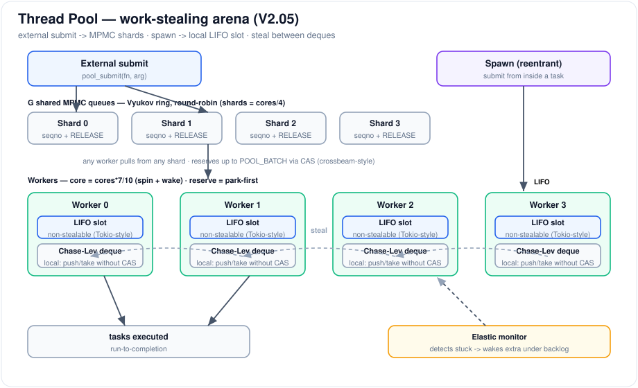
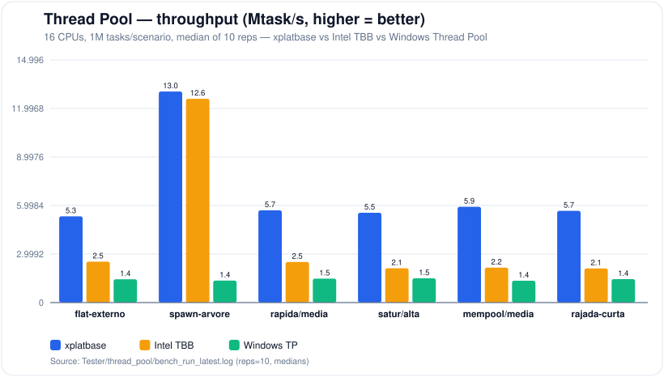
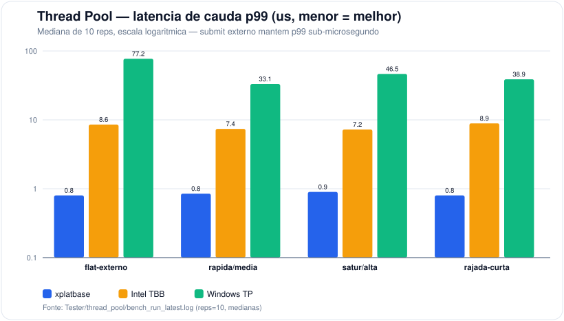
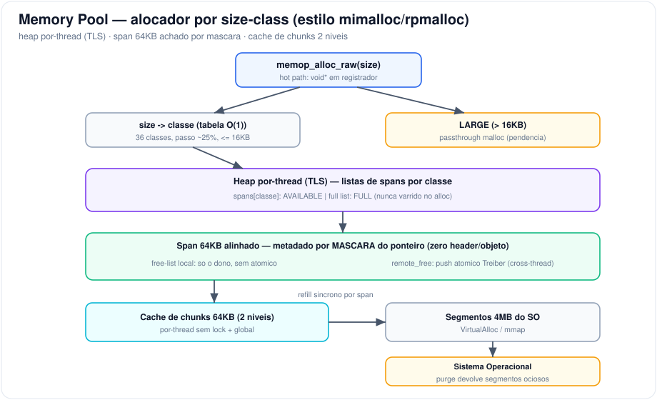
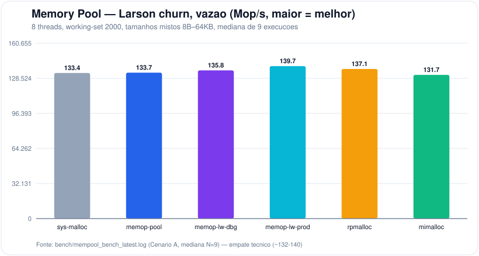
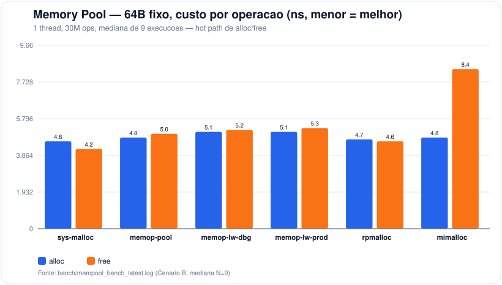
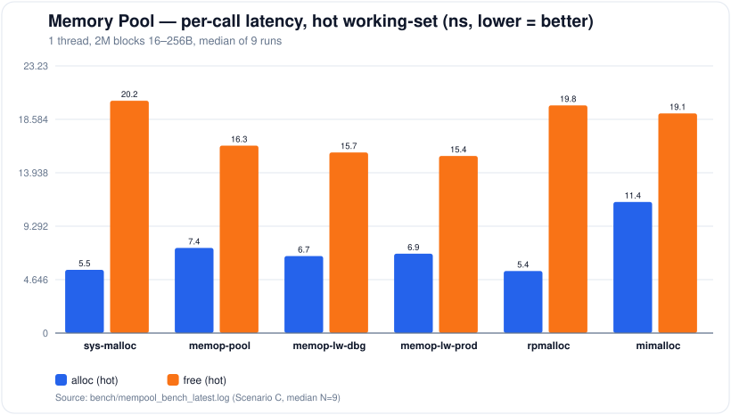
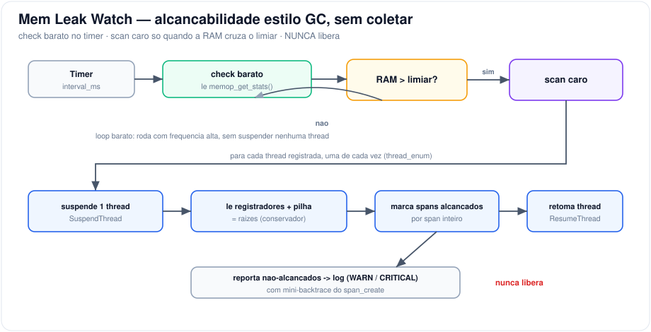

# Xplatbase

Biblioteca em **C (C11)** com um conjunto de tipos base e funções fundamentais
para uso **multiplataforma** (Windows / Linux, x86-64 e ARM). Centraliza
alocação de memória, tratamento de falhas, criação e sincronização de threads,
estruturas lock-free e um pool de tarefas de alto desempenho.

É a camada de base sobre a qual outros componentes são construídos: sem
dependências externas, com auto-inicialização no carregamento do módulo e API
estável exportada via `XPLATBASE_API`.

> Licença: MIT com atribuição obrigatória — © 2025 Sergio Paludo
> ([github.com/sergiocupa](https://github.com/sergiocupa)).

---

## Sumário

- [Inicialização](#inicialização)
- [Destaques](#destaques)
- [🧵 Thread Pool](#-thread-pool)
- [🧠 Memory Pool](#-memory-pool)
- [🔎 Mem Leak Watch](#-mem-leak-watch)
- [Módulos de apoio](#módulos-de-apoio)
- [Tipos base](#tipos-base)
- [Técnicas e créditos](#técnicas-e-créditos)

---

## Inicialização

A biblioteca **se auto-inicializa** no carregamento do módulo — não é preciso
chamar nada antes de usar. O ponto de entrada é `platform_init()`, registrado
para rodar automaticamente:

- **Windows/MSVC**: ponteiro em `.CRT$XCU` (antes do `main`).
- **Linux/GCC-Clang**: `__attribute__((constructor))`.

`platform_init()` valida UTF-8, sobe o sistema de eventos, inicializa o
[memory pool](#-memory-pool), registra os *hooks* de ciclo de vida de thread,
cria o [thread pool](#-thread-pool) global e inicia o
[mem leak watch](#-mem-leak-watch) com os defaults.

```c
#include "xplatbase.h"
#include "thread_pool.h"
#include "memory_pool.h"

static void task(void* arg) { /* ... */ }

int main(void)
{
    /* nada de setup: o módulo já subiu tudo ao ser carregado */
    void* p = memop_alloc_raw(128);
    pool_submit(task, p);
    pool_wait_idle();
    memop_free_raw(p);
    return 0;
}
```

Para **desligar a auto-inicialização** e chamar `platform_init()` manualmente,
defina `XPLATBASE_NO_AUTO_INIT` na compilação.

| Função | Descrição |
|---|---|
| `void platform_init(void)` | Inicializa a plataforma (idempotente). Auto-chamada no load, salvo `XPLATBASE_NO_AUTO_INIT`. |

---

## Destaques

Três componentes concentram o trabalho de engenharia da biblioteca e têm
**benchmark completo** contra referências do mercado:

| Componente | O que é | Referência comparada |
|---|---|---|
| [**Thread Pool**](#-thread-pool) | Pool de tarefas work-stealing com core/reserva e workers elásticos | Intel TBB, Windows Thread Pool |
| [**Memory Pool**](#-memory-pool) | Alocador por *size-class* com lanes por thread e cache global | rpmalloc, mimalloc, CRT malloc |
| [**Mem Leak Watch**](#-mem-leak-watch) | Monitor de vazamento por alcançabilidade (estilo GC, sem coletar) | — (custo medido sobre o memory pool) |

Todos os gráficos abaixo são medianas de múltiplas execuções (thread pool: 10
reps; memory pool: 9 execuções), num host de 16 CPUs.

---

## 🧵 Thread Pool

### Funcionamento

Pool de tarefas *run-to-completion* com escalonamento **work-stealing** em estilo
arena (design consolidado V2.05).



- **Submit externo** → *G* filas MPMC compartilhadas (`shards = cores/4`), em
  round-robin. Qualquer worker puxa de qualquer shard; o consumidor reserva até
  `POOL_BATCH` tarefas com um único CAS no `head`.
- **Spawn** (submit de dentro de uma task) → slot **LIFO não-roubável** do worker
  (o filho roda em seguida, com cache quente), com overflow para o **deque
  Chase-Lev local** (push/take sem CAS). Workers roubam entre deques.
- **Core / reserva**: `cores*7/10` workers giram e são acordados pelo submit; os
  demais ficam *park-first* e só engajam sob backlog → CPU plano ~75% com cauda
  baixa.
- **Worker elástico**: um monitor detecta workers presos em tarefas longas e
  acorda extras para drenar as curtas; eles se aposentam quando a carga passa.

### API

```c
#include "thread_pool.h"
typedef void (*pool_task_fn)(void*);
```

| Função | Descrição |
|---|---|
| `boolean pool_submit(pool_task_fn fn, void* arg)` | Enfileira uma tarefa no pool global. `false` se rejeitada. |
| `void pool_wait_idle(void)` | Bloqueia até todas as tarefas pendentes drenarem. |
| `void pool_dims(int* workers, int* core)` | Devolve o nº de workers e de cores ativos. |
| `ThreadPool* pool_create_relative(int cores_override)` | Cria um pool próprio (isolado do global). |
| `void pool_destroy_relative(ThreadPool* p)` | Destrói um pool criado acima. |
| `boolean pool_submit_relative(ThreadPool* p, pool_task_fn fn, void* arg)` | Submit num pool específico. |
| `void pool_wait_idle_relative(ThreadPool* p)` | Drena um pool específico. |

Tunáveis por `-D`: `POOL_CORE_NUM/DEN` (7/10), `POOL_ELASTIC_NUM/DEN`,
`POOL_SHARD_DIV` (4), `POOL_SHARD_CAP`, `POOL_DEQUE_CAP`, `POOL_MON_MS` (5),
`POOL_BATCH` (2), `POOL_LIFO_CAP` (8).

### Exemplo

```c
#include "thread_pool.h"
#include <stdint.h>

static void child(void* a)  { /* folha */ }

static void parent(void* a)
{
    /* submit reentrante: vai para o slot LIFO local (cache quente) */
    pool_submit(child, a);
}

int main(void)
{
    for (intptr_t i = 0; i < 100000; i++)
        pool_submit(parent, (void*)i);

    pool_wait_idle();        /* espera a árvore de tarefas drenar */
    return 0;
}
```

### Benchmark

16 CPUs, 1M tarefas por cenário, **mediana de 10 repetições**, contra
**Intel TBB** e **Windows Thread Pool**.



Vazão **~2,1×–2,7× acima do TBB** e **~3,7×–4,4× acima do Windows TP** no submit
externo; em *spawn* recursivo empata com o TBB (~1,04×) e supera o Windows TP em
~9,6×.



No submit externo o **p99 fica sub-microsegundo** (~0,8 µs) — cerca de **10×
melhor que o TBB** (~7–9 µs) e **40×–90× melhor que o Windows TP** (33–77 µs).

> **Nota sobre `mempool/media`:** é o cenário de tarefas mais curtas (cada task
> faz um alloc/free do memory pool), onde a vantagem de *dispatch* do pool é
> máxima — daí a maior vazão relativa. Duas ressalvas: (1) as colunas
> `cpu%`/`cores` saem como `0` — artefato da granularidade (~15,6 ms) do contador
> de tempo-de-CPU do Windows, já que o run dura ~10 ms; a **vazão em wall-clock é
> estável** (10 reps entre 4,9 e 6,4 Mtask/s). (2) Em troca da vazão, esse
> cenário tem a **pior cauda** do pool (p99 ~234 µs), por isso fica de fora do
> gráfico de p99.

Dados: [`Tester/thread_pool/`](Tester/thread_pool/) — `bench_run_latest.log` e
`thread_pool_bench_results*.tsv`.

---

## 🧠 Memory Pool

### Funcionamento

Alocador de propósito geral por **size-class**, com **heap por thread** (fast
path sem lock nem atômico) e cache de chunks devolvido ao SO por purga.



- Cada `size` mapeia para uma **classe** por tabela O(1) (36 classes, passo
  ~25%); blocos `> 16 KB` caem no caminho **LARGE** (passthrough `malloc`).
- Cada thread tem seu **heap (TLS)** com listas de spans por classe. O **span de
  64 KB** é alinhado e seu metadado é achado por **máscara do ponteiro** — zero
  header por objeto.
- A **free-list local** é tocada só pelo dono (sem atômico). `free` de outra
  thread empilha na `remote_free` do span (**pilha Treiber**); o dono drena
  depois.
- Refill síncrono por span a partir de um **cache de chunks de 64 KB em 2 níveis**
  (por thread + global), abastecido por **segmentos de 4 MB** do SO. A purga
  devolve segmentos ociosos.

### API

```c
#include "memory_pool.h"
```

| Função | Descrição |
|---|---|
| `void memop_init(void)` / `void memop_shutdown(void)` | Sobe / derruba o pool (auto no load). |
| `void* memop_alloc_raw(uint64 size)` | Fast path: devolve `void*` cru. |
| `void memop_free_raw(void* ptr)` | Libera um `memop_alloc_raw`. |
| `MemBuffer memop_alloc(uint64 size)` | Variante que devolve `{Ptr, Size}`. |
| `void memop_free(MemBuffer* buf)` | Libera um `memop_alloc`. |
| `void memop_purge(void)` | Trim explícito: devolve segmentos ociosos ao SO. |
| `void memop_get_stats(MemPoolStats* out)` | Snapshot de estatísticas (alloc/free, refills, RAM reservada…). |

### Exemplo

```c
#include "memory_pool.h"
#include <string.h>

/* fast path */
void* p = memop_alloc_raw(256);
memset(p, 0, 256);
memop_free_raw(p);

/* variante com tamanho embutido */
MemBuffer b = memop_alloc(4096);
memset(b.Ptr, 0, b.Size);
memop_free(&b);

/* observabilidade + trim */
MemPoolStats st;
memop_get_stats(&st);
memop_purge();
```

### Benchmark

16 CPUs / 8 threads, **mediana de 9 execuções**, contra **CRT malloc**,
**rpmalloc** e **mimalloc**. As variantes `memop-lw-*` são o mesmo alocador com o
[mem_leak_watch](#-mem-leak-watch) ligado por cima.



Sob *churn* multi-thread (Larson) é um **empate técnico** (~132–140 Mop/s). A
variância entre execuções é alta (o memop oscilou entre 107 e 149 Mop/s nas 9
rodadas), por isso as medianas.



No hot path de 64B fixo, alloc/free custam **~5 ns** por operação, competitivo
com os melhores e claramente à frente do mimalloc no `free`.



**Custo do mem_leak_watch:** `memop-lw-dbg`/`memop-lw-prod` ficam praticamente
sobrepostas ao `memop-pool` puro — o monitor **não onera o hot path** de forma
mensurável.

Dados: [`bench/mempool_bench_latest.log`](bench/mempool_bench_latest.log) e
[`bench/mempool_bench_medians.json`](bench/mempool_bench_medians.json).

---

## 🔎 Mem Leak Watch

### Funcionamento

Monitor de vazamento **sem coleta**, sobre o memory pool. Faz o mesmo
rastreamento de alcançabilidade que um GC usaria para decidir o que liberar
(raízes → ponteiros alcançados → spans marcados), mas **nunca libera nada**: o
que não foi alcançado vira aviso em log, com o mini-backtrace de onde o span foi
criado.



- **check barato** (timer): só lê `memop_get_stats()`, sem suspender thread
  nenhuma — roda com frequência alta.
- **scan caro** (só quando a RAM cruza o limiar): suspende cada thread
  registrada, uma de cada vez, lê registradores + pilha como raízes, percorre os
  spans e reporta o que sobrou.

### API

```c
#include "mem_leak_watch.h"
```

| Função | Descrição |
|---|---|
| `void mem_leak_watch_default_config(MemLeakWatchConfig* out)` | Preenche os defaults (intervalo/limiar por build). |
| `boolean mem_leak_watch_start(const MemLeakWatchConfig* cfg)` | Inicia o monitor (thread dedicada). `cfg=NULL` usa defaults. |
| `void mem_leak_watch_stop(void)` | Para e junta a thread. Seguro mesmo se não iniciado. |
| `void mem_leak_watch_scan_now(void)` | Força uma varredura agora (fora do timer). |

`MemLeakWatchConfig`: `enabled`, `interval_ms`, `warn_threshold_bytes`,
`crit_threshold_bytes`, `log_path` (NULL → `mem_leak_watch.log`).

### Exemplo

```c
#include "mem_leak_watch.h"

MemLeakWatchConfig cfg;
mem_leak_watch_default_config(&cfg);
cfg.interval_ms          = 5000;
cfg.warn_threshold_bytes = 256ull * 1024 * 1024;
mem_leak_watch_start(&cfg);
/* ... app roda ... */
mem_leak_watch_scan_now();     /* varredura manual sob demanda */
mem_leak_watch_stop();
```

### Limitações conhecidas (v1, confirmadas em teste)

- Só **Windows** por enquanto (`thread_activity_win` / `StackWalk64`).
- Só rastreia spans de *size-class* (≤ 16 KB); blocos LARGE ainda não entram.
- Não varre `.data`/`.bss` como raiz — ponteiro cuja única referência viva seja
  global/estática aparece como falso “vazamento”.
- Só enxerga threads criadas via `thread_create()` desta lib.
- Marca por **span inteiro**, não por bloco.
- Usa `SuspendThread`/`GetThreadContext` — mitigado suspendendo **uma thread por
  vez**, sem alocar/chamar `dbghelp` com threads suspensas.

O custo em produção é ~zero no hot path — ver `memop-lw-prod` no
[benchmark do memory pool](#benchmark-1).

---

## Módulos de apoio

| Módulo | Arquivo | Descrição |
|---|---|---|
| **Atomics** | `atomics.h` | Atômicos inline por plataforma (`InterlockedXxx` / `__atomic_*`): load/store, add, CAS, ponteiros, fences. |
| **Thread handler** | `thread_handler.h` | `thread_create`/`thread_join`/`thread_enum`, mutex, yield, atômicos de 64 bits — abstração fina sobre WinAPI/pthread. |
| **Thread wait** | `thread_wait.h` | Park/wake de baixo custo (`WaitOnAddress`/`WakeByAddress` no Windows, futex no Linux). |
| **Thread activity** | `thread_activity.h` | Amostra CPU por thread e classifica tarefas (NORMAL / LONG_CPU / LONG_BLOCKED) — base do worker elástico. |
| **Ring queue** | `ring_queue.h` | Fila MPMC estilo Vyukov, `head`/`tail` em linhas de cache separadas (sem false sharing). |
| **Event handler** | `event_handler.h` | Captura de contexto de erro e disparo antes de encerrar. |
| **List handler** | `list_hander.c` | `ListXPB` genérica com `malloc` do CRT (estruturas de vida do processo, fora do pool resetável). |

> `string_handler` está em fase de projeto e **não é coberto** por esta documentação.

### Thread handler — principais funções

| Função | Descrição |
|---|---|
| `Thread* thread_create(xthread_func_t* func, void* arg, int* status)` | Cria uma thread rastreada pela lib. |
| `void thread_join(Thread** t)` | Junta e libera. |
| `void thread_init(CreatedThread created, CreatedThread ended)` | Registra hooks de ciclo de vida (usados pelo memory pool). |
| `void thread_enum(ThreadEnumCb cb, void* ctx)` | Enumera, sob lock, as threads vivas (usado pelo mem leak watch). |

---

## Tipos base

Em `include/xplatbase.h`: `boolean`, `byte`, `int16..int64`, `uint16..uint64`, e
os contêineres `BufferXPB` (buffer tipado), `ListXPB` (lista genérica) e
`StringX` (string com capacidade). Macros `xpb_allocate`, `xpb_list_add`, etc.
carregam `__func__/__FILE__/__LINE__` para o rastreamento de erros
(`CallContextGlobalEvent`).

---

## Técnicas e créditos

O design combina técnicas consagradas (creditadas abaixo) com integração e
mecanismos próprios do autor. As anotações também estão nos comentários de cada
`.c`.

### Thread Pool

| Técnica | Origem / crédito |
|---|---|
| Fila MPMC *bounded* com *sequence number* por slot | **Dmitry Vyukov** — bounded MPMC queue |
| Deque work-stealing local (push/take/steal) | **Chase & Lev (2005)**; modelo de memória correto por **Lê, Pop, Cohen, Zappa Nardelli (2013)** |
| Reserva de lote por CAS no `head` (`steal_batch`) | **Crossbeam** (projeto Rust) |
| Slot LIFO não-roubável para spawn reentrante | inspirado no runtime **Tokio** (Rust) |
| **core/reserva** (spin+wake vs park-first) + **worker elástico** (monitor acorda extras sob backlog) | **design próprio** — Sergio Paludo (V2.05) |

### Memory Pool

| Técnica | Origem / crédito |
|---|---|
| Span 64 KB alinhado, metadado por **máscara do ponteiro** (zero header/objeto) | **mimalloc** (Daan Leijen, Microsoft Research) / **rpmalloc** (Mattias Jansson) |
| Size-classes finas + mapeamento O(1) `size→classe` | linhagem **tcmalloc / mimalloc** |
| Heap por thread (TLS), free-list local sem atômico | **mimalloc / rpmalloc** |
| Free remoto por pilha atômica (`remote_free`) | **pilha de Treiber** — R. Kent Treiber (IBM, 1986) |
| Integração "melhor de cada lib" + **cache de chunks 2 níveis** + refill síncrono por span | **design próprio** — Sergio Paludo |

### Mem Leak Watch

| Técnica | Origem / crédito |
|---|---|
| Varredura **conservadora** de alcançabilidade (raízes = registradores + pilha; ponteiros interiores) | GC conservador de **Boehm–Demers–Weiser** (Hans Boehm, Alan Demers, Mark Weiser) |
| Suspensão/inspeção de threads e caminhada de pilha | **Win32** `SuspendThread`/`GetThreadContext` + `StackWalk64` (dbghelp); limites de pilha via `NtQueryInformationThread` (TEB) |
| Aplicação **"watch sem coletar"** (reporta em vez de liberar), montada sobre o memory pool com snapshot de spans desacoplado | **design próprio** — Sergio Paludo |

---

## Status

Projeto em fase de projeto e consolidação. Os três destaques estão funcionais e
com benchmark; os módulos de apoio dão a base multiplataforma. Portabilidade
Linux é parcial em alguns caminhos (o mem_leak_watch é Windows-only na v1).
